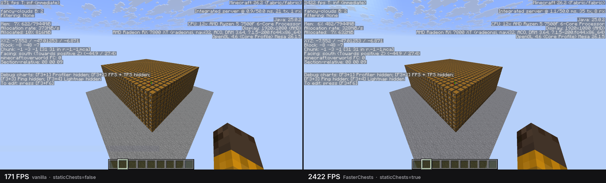

# Faster Block Entities

Optimizes certain block entities (chests, beds and more) by rendering them as ordinary block models instead of animated ones.

## Measured



## Configuration

`config/fasterblockentities.properties`

```properties
staticChests=true
staticShulkerBoxes=false
```

Chests covers normal, trapped, ender and every copper variant. Shulker boxes covers the undyed box
and all sixteen colours. Shulker boxes are off by default because the lid opening is useful feedback.

Set a key to `false` to restore that block's vanilla renderer and animation. The mod then leaves
rendering entirely to Minecraft, so there is no double-drawing. Changes take effect on the next
launch.

Supported: 26.1.2 and 26.2, on Fabric and NeoForge. Client-side only. No dependencies.

## Credit

The chest model, blockstate and atlas resources are taken from
[FastChest](https://github.com/FakeDomi/FastChest) by FakeDomi. Faster Block Entities ports
the approach to Minecraft 26.x. The shulker box resources are generated from vanilla's own
entity model layers by `./gradlew generateModels`.

## License

GPL-3.0-or-later. See `LICENSE`.

The blockstate, model and atlas resources originate from FastChest and remain under their
original MIT terms; see `NOTICE`.
